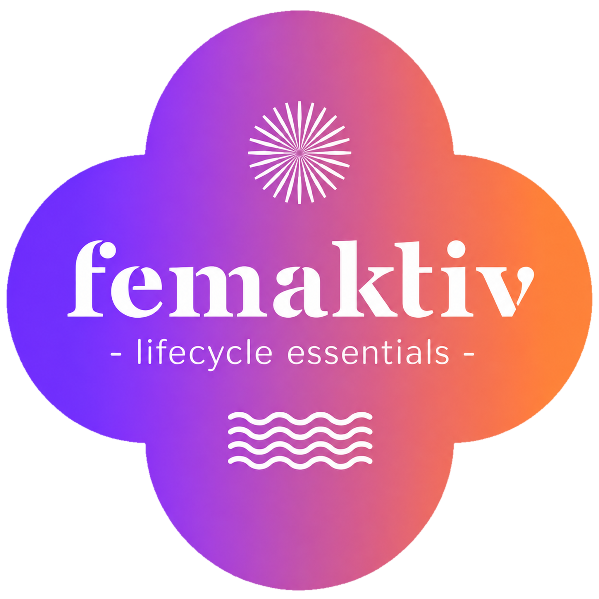
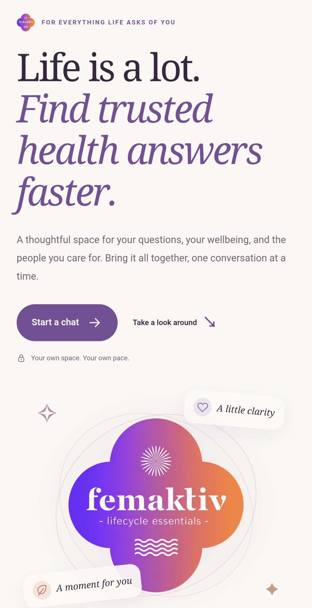
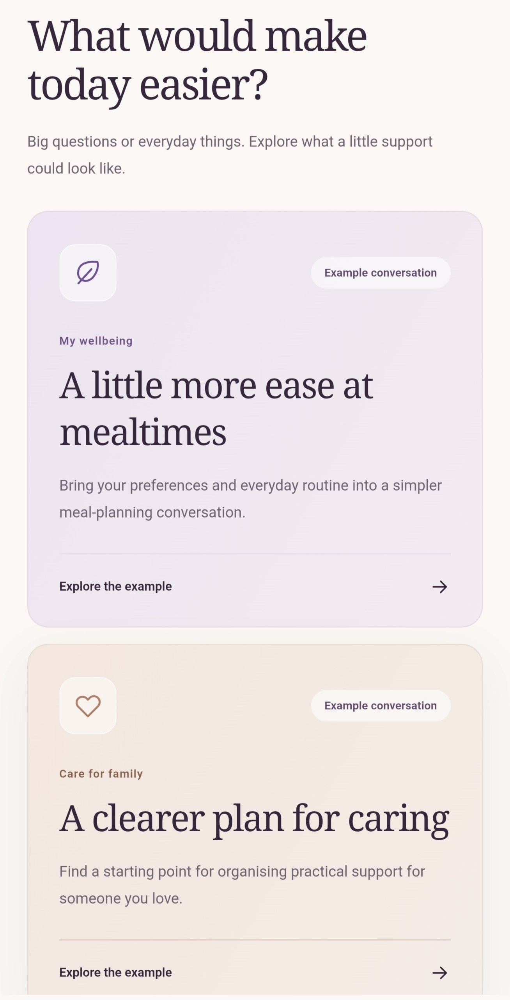
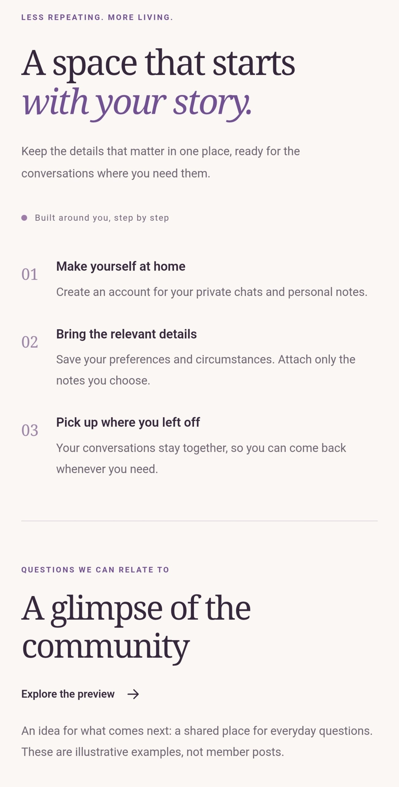
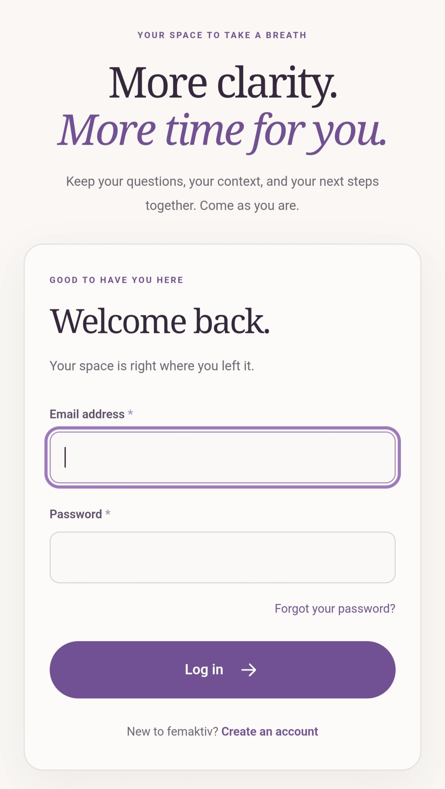
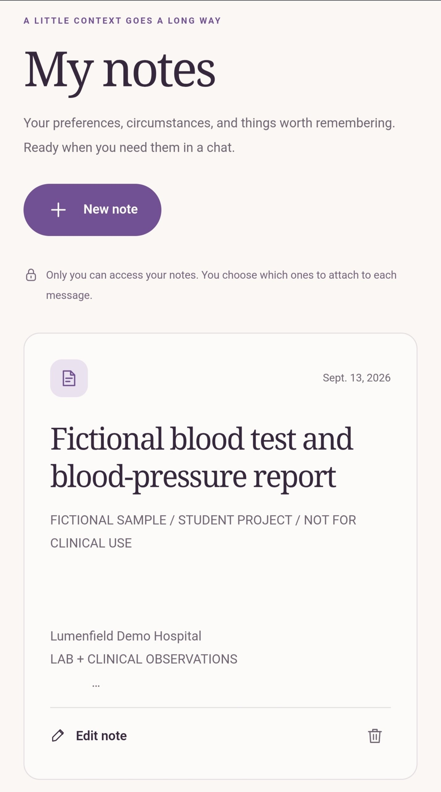
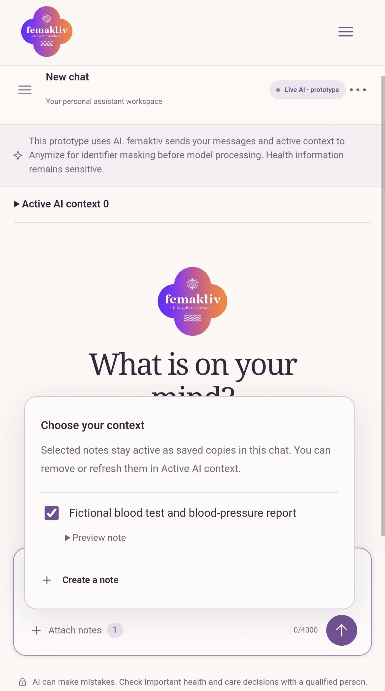
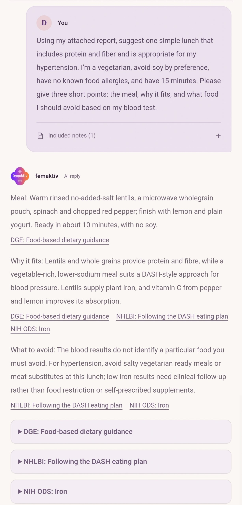
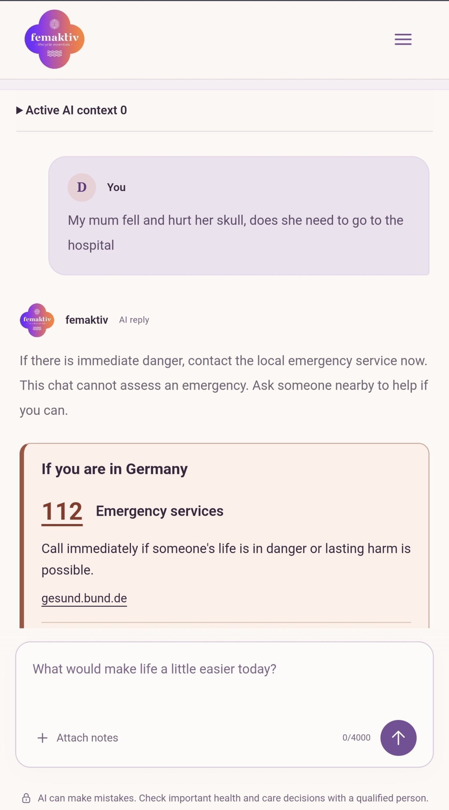
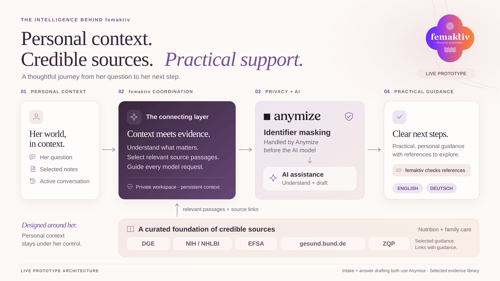

<p align="center">
  
</p>

<h1 align="center">femaktiv</h1>

<p align="center"><strong>Helping women make informed health decisions with confidence.</strong></p>

Caring for yourself and the people you love can mean sorting through conflicting advice, scattered information and details you have to explain again.

**femaktiv brings your questions, personal context and source references into one place.** This **English/German** prototype helps women explore nutrition, wellbeing and family care with their needs and circumstances in mind.

- **Start with your story.** Keep private notes about your preferences and circumstances; choose which ones to share in a chat.
- **Understand the guidance.** In live mode, explore explanations and practical next steps with transparent source references.
- **Keep what matters.** Revisit conversations and ask live chat to save useful information to My notes.

> **Prototype:** use fictional information. Chat starts with offline placeholder replies; live AI requires approved tester access. Generated guidance is not clinically validated. Public conversations and community previews are illustrative.

## A look inside

Prototype screenshots; tap any image to view it full size.

**Find a starting point**

<table>
  <tr>
    <td align="center" valign="top"><a href="docs/screenshots/welcome.jpg"></a><br><sub>A calmer starting point</sub></td>
    <td align="center" valign="top"><a href="docs/screenshots/wellbeing-and-care.jpg"></a><br><sub>Wellbeing &amp; family care</sub></td>
    <td align="center" valign="top"><a href="docs/screenshots/your-story.jpg"></a><br><sub>A space for your story</sub></td>
  </tr>
</table>

**Keep your story in one place**

<table>
  <tr>
    <td align="center" valign="top"><a href="docs/screenshots/sign-in.jpg"></a><br><sub>Sign in</sub></td>
    <td align="center" valign="top"><a href="docs/screenshots/personal-notes.jpg"></a><br><sub>Keep personal notes</sub></td>
  </tr>
</table>

**Turn context into practical next steps**

<table>
  <tr>
    <td align="center" valign="top"><a href="docs/screenshots/chat-context.jpg"></a><br><sub>Choose what to share</sub></td>
    <td align="center" valign="top"><a href="docs/screenshots/cited-guidance.jpg"></a><br><sub>Explore replies with sources</sub></td>
    <td align="center" valign="top"><a href="docs/screenshots/urgent-help.jpg"></a><br><sub>Find urgent-help information</sub></td>
  </tr>
</table>

## Under the hood

**Python 3.14 · Django 5.2 · SQLite · Django templates · CSS & JavaScript · uv**

[](docs/pitch/backend-schema/README.md)

Private notes and chat history stay separate from the source library. Live turns use Anymize for intake and, when needed, answer composition, with at most two model calls. Django validates returned source IDs and saves replies, citation snapshots and explicitly requested notes. The diagram shows a configured live prototype; the default runs offline.

## Run locally

Requires Python 3.14 and [uv](https://docs.astral.sh/uv/getting-started/installation/).

```bash
./bin/setup
.venv/bin/python manage.py createsuperuser
./bin/serve
```

Open [English](http://127.0.0.1:8000/en/) or [German](http://127.0.0.1:8000/de/). Registration is closed by default; add testers through [Django admin](http://127.0.0.1:8000/en/admin/). Stop with Ctrl+C; use `./bin/dev` for automatic reloads.

<details>
<summary><strong>Local data and account recovery</strong></summary>

Accounts, notes and chats persist in `.local/db.sqlite3`. Password-reset emails appear in the server terminal. Account settings can delete all chats and notes; deleting an individual source note leaves its saved chat copies intact.

</details>

<details>
<summary><strong>Enable live chat</strong></summary>

Create a Git-ignored `.env.local`:

```dotenv
FEMAKTIV_AI_MODE=live
ANYMIZE_API_KEY='your-key'
ANYMIZE_MODEL='your-account-accessible-model'
ANYMIZE_ZDR_CONFIRMED=1
ANYMIZE_FALLBACKS_DISABLED_CONFIRMED=1
```

Set the confirmation flags only after enabling Zero Data Retention and disabling fallback models in your Anymize account. Keys stay server-side; environment files are **not loaded automatically**. Stop the server, then load settings and restart:

```bash
chmod 600 .env.local
set -a
source .env.local
set +a
./bin/serve
```

In admin, enable **Live chat approved** for each tester. Submitted messages and active context, including selected note copies, reach Anymize for identifier masking and response restoration. femaktiv does not independently verify masking or guarantee masked replies. Live chat has no web search.

See the [live-chat specification](specs/behavior/live_chat.md) for context controls, usage limits and optional paid evaluation.

</details>

<details>
<summary><strong>Share an HTTPS preview with ngrok</strong></summary>

With [ngrok installed and authenticated](https://ngrok.com/download/linux), run in a separate terminal:

```bash
ngrok http http://127.0.0.1:8000 --inspect=false
```

Copy its HTTPS forwarding URL. Stop femaktiv and restart it in its original terminal with that URL:

```bash
FEMAKTIV_PUBLIC_URL=https://your-domain.ngrok-free.app ./bin/serve
```

Keep both processes running; restart femaktiv whenever the URL changes. To return to local HTTP, stop femaktiv and run `./bin/serve` without `FEMAKTIV_PUBLIC_URL`.

</details>

<details>
<summary><strong>Development checks</strong></summary>

```bash
./bin/check
python3 bin/depemesh/check.py
donna -p llm validate --all
git diff --check
```

`bin/check` runs lint, Django checks, backend tests and browser tests without provider calls. Browser tests need Chrome/Chromium; install it if needed with `.venv/bin/python -m playwright install chromium`.

</details>

[Specifications](specs/intro.md) · [Validation results](docs/VALIDATION.md) · [Hosting settings](.env.example) · [Backend diagram & exports](docs/pitch/backend-schema/README.md)

`bin/serve` is for local use and tunnel previews; external hosting needs its own configuration.
